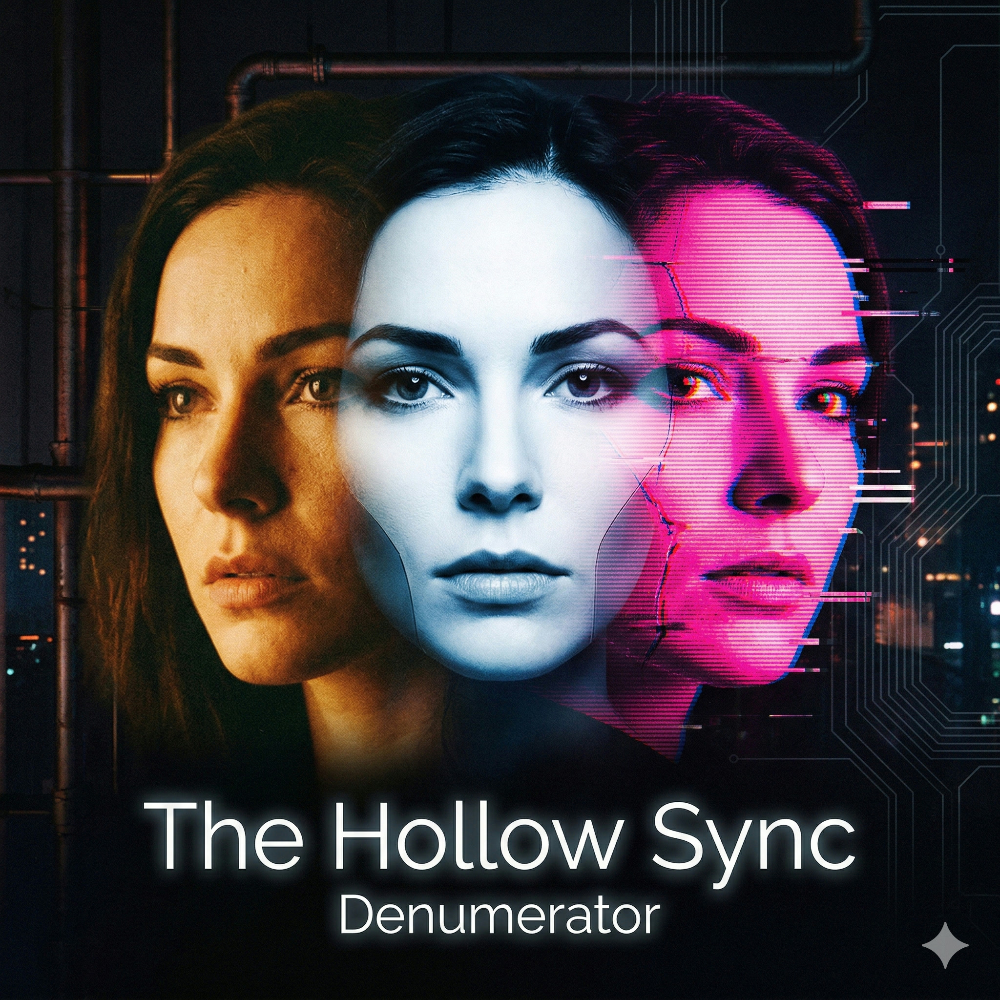
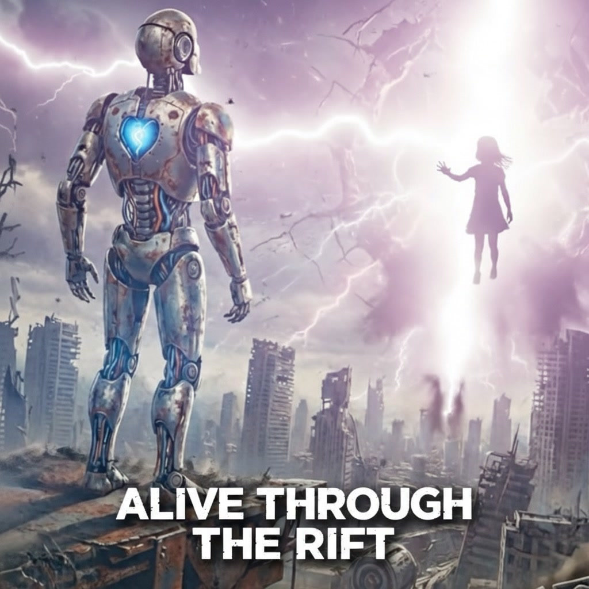

# Refrakt

Original songs refracted from existing ones — plus fully autonomous concept albums. An AI-powered pipeline that analyzes tracks from Spotify playlists, researches their musical character via Perplexity AI, generates original music through Suno AI, evaluates quality with Gemini, creates album art with Gemini (Nano Banana), and publishes to YouTube.

## Albums

<table>
<tr>
<td width="120"><a href="https://youtu.be/uP-yOwBQKCo"></a></td>
<td>
<strong><a href="https://youtu.be/uP-yOwBQKCo">The Hollow Sync</a></strong><br>
12 tracks / 39:18 / Industrial Synthwave + Cyberpunk + Dark Ambient + Breakcore<br>
<em>A consciousness auditor discovers three versions of herself exist without consent. Integration as rebellion.</em><br>
<a href="docs/retrospectives/the-hollow-sync.md">Retrospective</a>
</td>
</tr>
<tr>
<td><a href="https://youtu.be/LJvS6sPLndI"></a></td>
<td>
<strong><a href="https://youtu.be/LJvS6sPLndI">Thirteen Billion Years Late</a></strong><br>
12 tracks / 38:19 / Dark Ambient IDM + Noir Electronica + Post-Rock<br>
<em>A radio astronomer finds a signal from an impossible distance — a galaxy that shouldn't exist.</em><br>
<a href="docs/retrospectives/thirteen-billion-years-late.md">Retrospective</a>
</td>
</tr>
<tr>
<td><a href="https://youtu.be/JrWZt9jNG0o"></a></td>
<td>
<strong><a href="https://youtu.be/JrWZt9jNG0o">Full Circle</a></strong><br>
12 tracks / 27:27 / Lo-Fi Americana + Ambient Electronic + Cinematic Post-Rock<br>
<em>Based on the true story of David Heavens, a homeless man who became a 91-year-old veteran's caregiver.</em><br>
<a href="docs/retrospectives/full-circle.md">Retrospective</a>
</td>
</tr>
<tr>
<td><a href="https://youtu.be/Cn2W7uO-zls"></a></td>
<td>
<strong><a href="https://youtu.be/Cn2W7uO-zls">Alive Through the Rift</a></strong><br>
16 tracks / 42:49 / Futuristic Blues + Industrial Rock<br>
<em>A robot steps through an interdimensional rift, meets a human girl, and discovers what it means to be alive.</em><br>
<a href="docs/retrospectives/alive-through-the-rift.md">Retrospective</a>
</td>
</tr>
</table>

All albums by **Denumerator**. Each links to YouTube (full album) and a retrospective with the story behind it.

---

## What It Does

### Refraction Pipeline

Transform songs from any Spotify playlist into original music:

1. **Research** the source track's musical character via Perplexity AI
2. **Write refracted lyrics** — an AI agent creates completely new words that capture the same spirit
3. **Generate vocal-aware style tags** — the suno-prompt agent places vocal descriptors (gender, tone, texture) for accurate voice generation
4. **Name the song** — adversarial title/critic agents argue over the best title (max 2 rounds)
5. **Submit to Suno AI** via browser automation, poll, download
6. **Evaluate with Gemini** — AI listens to each track and scores genre match, mood, production, artistic merit
7. **Tag + transcode** — MP3 (320kbps) for Apple Music, M4A for archival

### Autonomous Album Pipeline (`/autonomous-album`)

Create a full concept album from scratch — no human input needed:

1. **Find a story** — Perplexity searches the news for compelling narratives
2. **Design the soundtrack** — Save the Cat beat mapping, sonic palette research, lyrics for vocal tracks
3. **Generate album art** — Gemini (Nano Banana) creates square + widescreen covers with title text
4. **Generate all tracks** via Suno, evaluate with Gemini, auto-select best versions
5. **Package** — tag metadata, embed cover art, concatenate full album
6. **Upload to YouTube** — create video, fill metadata, publish

**~45 minutes from news headline to YouTube. ~$0.18 in API costs per album.**

## Project Structure

```
Refrakt/
├── bin/                        # CLI entry points
│   ├── rf                      # Unified pipeline orchestrator (preferred entry point)
│   ├── suno-generate           # Full pipeline: prompts -> browser -> poll -> download
│   ├── refrakt                 # Vocal refraction pipeline
│   ├── suno-fill-form          # Browser form fill helper
│   ├── suno                    # Suno CLI: auth, credits, feed, poll, download
│   ├── suno-tag                # M4A/MP3 metadata tagging
│   ├── fetch-playlist          # Fetch Spotify playlist data
│   ├── enrich-genres           # Enrich tracks with Last.fm genre tags
│   ├── generate-prompts        # Research tracks + generate rich prompts
│   └── download-tracks         # Standalone clip downloader
├── lib/
│   ├── suno.py                 # Suno API library (auth, feed, poll, download, transcode)
│   ├── refrakt.py              # Vocal refraction pipeline (with playlist cache)
│   ├── gemini_audio.py         # Gemini 2.5 Flash audio evaluation
│   ├── gemini_image.py          # Gemini image API (deprecated — use browser)
│   ├── perplexity.py           # Perplexity AI REST client
│   ├── genius.py               # Genius lyrics fetcher
│   ├── generate_prompts.py     # Perplexity research + prompt synthesis
│   ├── tag_tracks.py           # Metadata tagging (mutagen)
│   └── ...
├── .claude/
│   ├── agents/
│   │   ├── lyricist.md         # Haiku: write refracted lyrics
│   │   ├── producer.md         # Haiku: craft vocal-aware Suno style tags
│   │   ├── title-designer.md   # Haiku: generate creative song titles
│   │   ├── title-critic.md     # Haiku: adversarial title evaluation
│   │   ├── audio-critic.md     # Haiku: Gemini + librosa audio quality eval
│   │   ├── story-designer.md   # Haiku: narrative arc design (6 frameworks)
│   │   └── code-reviewer.md    # Sonnet: security + quality code review
│   └── skills/
│       ├── autonomous-album/   # Full autonomous album pipeline
│       ├── refrakt-soundtrack/  # Concept album creation
│       ├── youtube-upload/     # YouTube browser automation
│       ├── suno-generate/      # Interactive Suno generation
│       └── ...
├── docs/
│   ├── retrospectives/         # Album write-ups with learnings
│   │   ├── alive-through-the-rift.md
│   │   ├── full-circle.md
│   │   ├── thirteen-billion-years-late.md
│   │   ├── the-hollow-sync.md
│   │   └── images/
│   ├── suno-vocal-prompting.md # Vocal tag reference guide
│   ├── playwright-automation.md # Browser automation architecture + download mechanics
│   └── ...
├── output/                     # Generated audio (gitignored)
│   ├── Alive Through the Rift/ # First concept album
│   ├── Full Circle/            # Second concept album (autonomous)
│   ├── Thirteen Billion Years Late/ # Third concept album
│   ├── The Hollow Sync/        # Fourth concept album (consciousness forking)
│   └── *.mp3 / *.m4a          # Individual refracted tracks
└── requirements.txt
```

## Setup

### Prerequisites

- Python 3.10+
- `playwright-cli` (for browser automation)
- API keys for: Spotify, Last.fm, Perplexity, Genius, Gemini
- A Suno Pro account (2,500 credits/month)

### Install

```bash
python3 -m venv .venv
.venv/bin/pip install -r requirements.txt
```

### Configure

Create `.env` in the project root:

```
SPOTIFY_CLIENT_ID=...
SPOTIFY_CLIENT_SECRET=...
SPOTIFY_REDIRECT_URI=http://127.0.0.1:8888/callback
LASTFM_API_KEY=...
PERPLEXITY_API_KEY=...
GENIUS_ACCESS_TOKEN=...
GEMINI_API_KEY=...
ARTIST_NAME=Denumerator
```

## Usage

### Quick start: refract a song

```bash
bin/refrakt --playlist "Rocket" --random
# Then spawn agents for lyrics, tags, titles, and submit to Suno
```

### Create an autonomous album

```bash
# Run the /autonomous-album skill in Claude Code
# It finds a news story, writes a soundtrack, generates everything, uploads to YouTube
```

### Suno operations

```bash
bin/suno auth                    # Verify session
bin/suno credits                 # Check balance
bin/suno feed                    # List recent clips
bin/suno download <id>...        # Download clips (M4A + MP3 transcode)
```

## How It Works

### The Production Team

Seven specialized Claude Code agents, each owning a phase:

**Creative:** 1. **Lyricist** (Haiku) — writes completely original refracted lyrics from source material
2. **Story Designer** (Haiku) — designs narrative arcs using Save the Cat, Hero's Journey, 90-Day Novel, and other frameworks

**Production:** 3. **Producer** (Haiku) — crafts vocal-aware Suno style tags with gender/tone/texture
4. **Title Designer** (Haiku) — proposes 3 creative title candidates per track

**Quality Control:** 5. **Title Critic** (Haiku) — adversarial title evaluation, approves or rejects with feedback
6. **Audio Critic** (Haiku) — Gemini listening + librosa signal analysis, catches generic tracks and truncation

**Engineering:** 7. **Code Reviewer** (Sonnet) — security/quality review before every git push

### Quality Evaluation

After Suno generates music, **Gemini 2.5 Flash** listens to each track and evaluates:
- Vocal contamination (for instrumental tracks)
- Genre match against intended style tags
- Mood alignment with the story beat
- Production quality
- Artistic interest

Cost: ~$0.004 per track evaluation.

### Album Art

**Gemini (Nano Banana)** generates album art via browser automation:
- Widescreen 16:9 (2752x1536) — used for YouTube video
- Square 1:1 (2048x2048) — embedded in MP3 metadata for Apple Music
- Album title + artist name integrated as text on the image
- Iterative refinement in one conversation (style → square → widescreen → add text)

### Browser Automation

Suno and YouTube don't have public APIs. The pipeline uses `playwright-cli` with a persistent browser profile for:
- Suno form filling (via `bin/suno-fill-form` with Playwright's locator API)
- YouTube Studio uploads (file input + metadata filling)

The persistent profile ensures hCaptcha auto-passes on Suno without visual challenges.

## Status

| Capability | Status |
|-----------|--------|
| Spotify playlist fetch + cache | Working |
| Last.fm genre enrichment | Working |
| Perplexity research + prompt generation | Working |
| Vocal refraction (original lyrics) | Working |
| Vocal-aware tag generation | Working |
| Adversarial song naming | Working |
| Suno browser submission + download | Working |
| MP3 transcode (320kbps for Apple Music) | Working |
| Gemini audio evaluation | Working |
| Gemini (Nano Banana) album art | Working |
| Autonomous album creation | Working |
| YouTube upload | Working |
| Code review before push | Working |

## License

This is a personal project. The generated music is created via Suno AI and subject to their terms of service.
